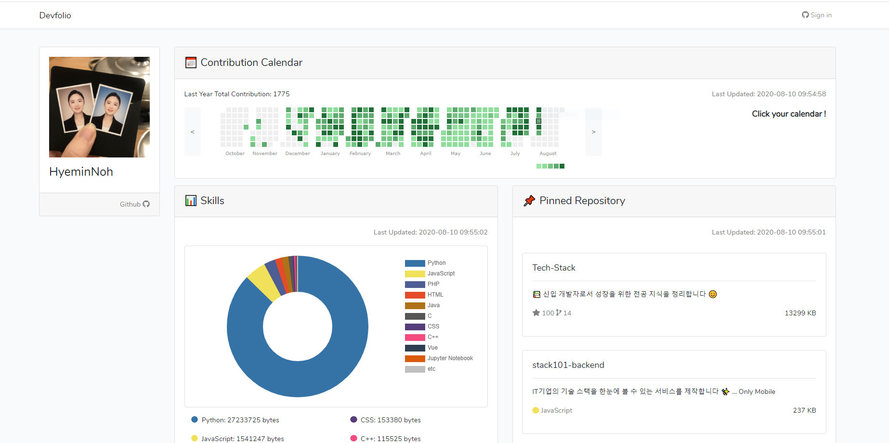

# Devfolio

    Github 연동을 통해 개발자 포트폴리오를 자동으로 생성합니다.📝

#### Screenshot

<kbd></kbd>

#### How to run

```shell script
git clone https://github.com/HyeminNoh/Devfolio.git
cd Devfolio
php artisan key:generate
php artisan migrate
php artisan serve
```

#### Environment

* PHP 7.4
* MySQL 8.0
* Laravel 7.x
